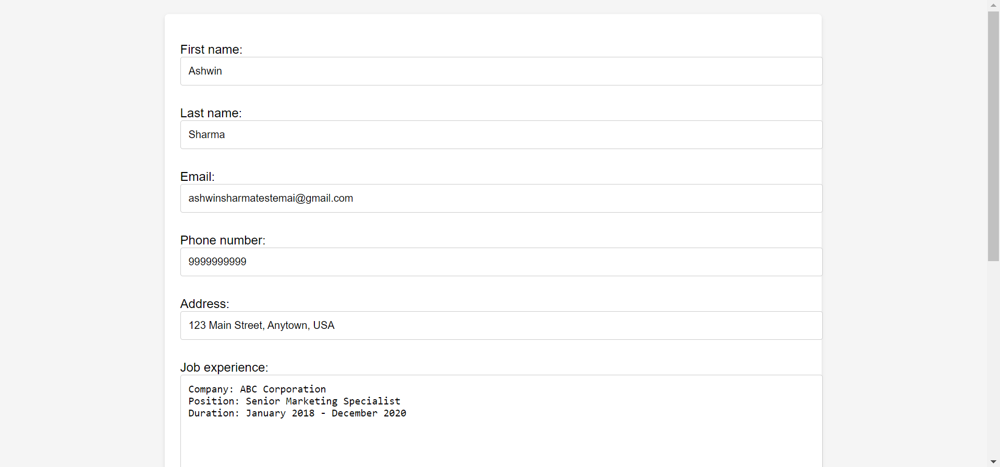
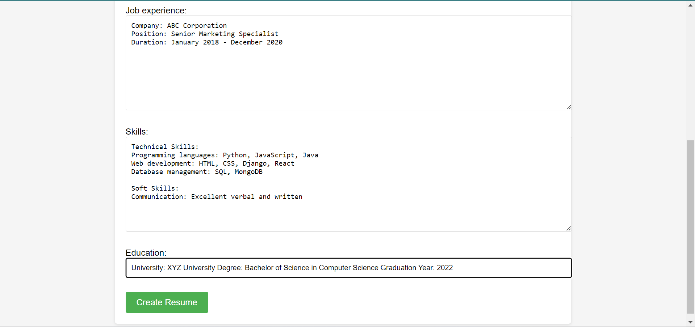
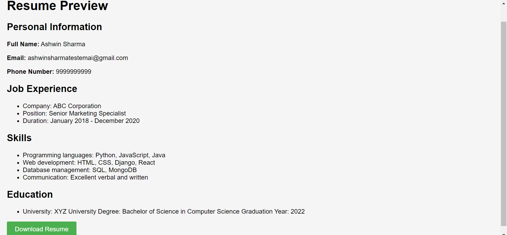

# Resume-builder
The Resume Building App is a web application developed with Django that allows users to create and preview their resumes. It provides a user-friendly interface for entering personal information, job experience, skills, and education details, and generates a preview of the resume based on the entered data.

## Features

- User-friendly form for entering personal information, job experience, skills, and education details.
- Two-column layout for separating personal information from job experience, skills, and education.
- Preview page to display the entered resume information in a formatted manner.
- Download feature to save the preview page as an HTML file.

## Screenshots

# Include some screenshots of your application here to give users a visual understanding of its interface and features. For example:

*Create Resume*

*Preview and Download Resume*

